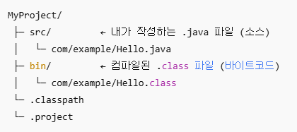

## 01-1 프로그래밍 언어와 자바

p.38)

### 1. 소스 파일

1-1.  
**소스 파일**이란 프로그래밍 언어로, 컴퓨터가 바로 이해할 수 없는 언어이기 때문에 **컴파일**이라는 과정이 필요.

1-2.  
**JDK : 자바 개발 도구** (Java Development Kit)  
쉽게 설치 가능한 JDK에는 Open JDK와 Oracle JDK가 있다.

1-3.  
JDK를 실행 후 [사용자 계정 컨트롤]에서 디바이스 변경을 허용하면 C:\Program Files\Java 경로에 저장된다.

1-4.  
자바 컴파일러와 실행 명령어는 \bin 폴더에 있다.

### 2. bin 폴더

JDK 설치 폴더 안의 **bin 폴더**에는 개발할 때 필요한 **자바 컴파일러 파일**과 **실행 명령어 파일이 저장**되어 있다.  
이들은 bin 폴더 안에 있기 때문에 다른 폴더에서 실행할 수 없는데, **다른 폴더에서 실행하기 위해서는 환경변수 path에 bin 폴더를 등록**해야한다.

## 01-3 자바 프로그램 개발 과정

p.67 ~ 68)

### 1. 자바 프로그램 개발 과정

① 소스 파일 작성  
② javac 명령어로 컴파일  
③ 컴퓨터 언어로 변환이 완료되면 java 명령어로 실행  
④ 실행 결과를 확인

### 2. 자바 소스

2-1.  
자바 소스를 컴파일하면 확장명이 .class 라는 바이트 코드 파일이 생성된다.

2-2.  
main() 메소드는 클래스 블록 내부에 존재해야 실행 시 컴퓨터가 읽을 수 있다.

2-3.  
java 명령어로 실행하면 main() 메소드를 찾아 블록 내부를 실행한다. 그러므로 중괄호는 필수.

2-4.  
컴파일 후 실행하기 위해서는 반드시 문장 끝에 세미콜론(;)이 있어야 한다. 없으면 에러 뜸.

### 3. 주석

3-1.  
// 와 같은 라인의 내용은 주석 처리가 된다.

3-2.  
/* 부터 */ 까지의 내용은 몇 줄이 됐든 전부 주석 처리가 된다.

3-3.  
주석은 컴파일 과정에서 무시되고 실행문만 바이트 코드로 번역되므로, 주석을 많이 작성한다고 해서 바이트 코드 파일의 크기가 커지는 것이 아니다.

3-4.  
문자열 내부(" ")의 경우, 주석 기호는 주석문이 아니라 문자열 데이터로 인식하기 때문에 사용할 수 없다.

### 4. 이클립스의 자바 프로젝트

4-1.  
이클립스 환경에서의 기본 폴더 구조 :  

따라서 기본적으로 소스 파일과 바이트 코드 파일이 저장되는 폴더가 다르다.

4-2.  
위의 이미지를 참고해보면, 자바 소스 파일을 작성하는 폴더는 src 이다.

4-3.  
선언되는 클래스 이름은 반드시 소스 파일 이름과 동일해야 한다.

4-4.  

