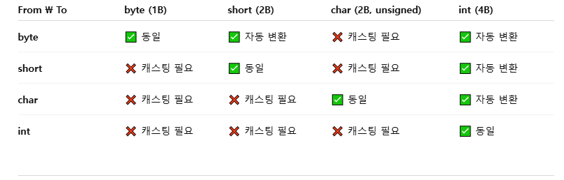

그럼 위의 경우,

short shortValue = charValue

면 뭐가 에러나느거야?

ChatGPT의 말:

좋은 포인트 집었네 👍

코드로 보자 👇

```
char charValue = 'A';   // 'A' = 65
short shortValue = charValue; // ?
```

1️⃣ char vs short 크기 차이

char : 2바이트 (0 ~ 65535, 음수 없음 → unsigned)

short: 2바이트 (-32768 ~ 32767, 음수 있음 → signed)

즉, 크기는 같지만 표현 범위가 다르지.

2️⃣ 왜 에러?

자바 컴파일러 입장에서는:

char → int 변환은 자동 가능 (확대 변환, 안전)

char → short 변환은 축소 변환 (narrowing) 으로 봐서 자동 변환 불가

이유는 👉 char 가 가질 수 있는 값(0~65535) 중 일부는 short 가 표현 못하기 때문이야.
예: char 가 40000이면, short 는 -32768 ~ 32767까지만 가능하니까 깨져버릴 수 있음.

3️⃣ 해결 방법

강제로 캐스팅하면 돼:

```
short shortValue = (short) charValue;
System.out.println(shortValue); // 65 (이 경우는 문제 없음)
```

이건 'A' → 65라서 short 안에 안전하게 들어가니까 정상 출력돼.
근데 만약 char 값이 40000이면, short 에 들어가면서 오버플로우 돼서 엉뚱한 음수가 나와.

✅ 정리

short shortValue = charValue; → 컴파일 에러 (자동 변환 안 됨)

이유: char (0~65535) ↔ short (-32768~32767) 범위 차이 때문에 안전하지 않음

(short) charValue 로 강제 캐스팅해야 함

char=40000 같은 값으로 넣고 short 변환했을 때 실제로 어떤 값 나오는지도 예시로 보여줄까?

나의 말:
아하 그니까 char 에 short 범위 내의 값(A)이 저장돼있어도
기본적으로 short의 양수 범위보다 char의 범위가 넓으니까 거기서부터 에러가 난다는거지?

ChatGPT의 말:

정확히 이해했네 👌

맞아, 'A' 처럼 값이 65라서 short 범위 안에 들어가더라도,
**컴파일러는 "값"이 아니라 "타입의 전체 범위"를 기준으로 안전성을 판단해.**

```
char 범위: 0 ~ 65535

short 범위: -32768 ~ 32767
```

👉 char 가 가질 수 있는 최댓값(65535)은 short 가 표현 불가능하니까,
"언제든 오버플로우 위험 있음 → 자동 변환 금지" → 컴파일 에러 발생.

그래서 실제 값이 안전하더라도 short shortValue = charValue; 는 허용되지 않고,
반드시 이렇게 강제 변환해야 해:

short shortValue = (short) charValue; // 'A'일 때는 65가 저장됨

📌 핵심 정리

**자바의 자동 형변환은 값 기준이 아니라 타입의 표현 범위 기준으로 결정된다.**

char → short 는 narrowing 변환이라 항상 캐스팅 필요.

원하면 byte, char, short, int 사이의 자동 변환 규칙 표도 정리해줄까?

나의 말:
응

ChatGPT의 말:

좋아 👍 그럼 byte, char, short, int 사이에서 자동 변환이 언제 되고, 언제 에러 나는지 한눈에 볼 수 있게 정리해줄게.

🔹 기본 자동 변환 규칙

작은 타입 → 큰 타입 (손실 없음) : 자동 변환 O

범위 겹치지 않음 / 손실 가능 : 자동 변환 X → 반드시 (캐스팅) 필요

🔹 변환 표 (Java)



🔹 예시 코드

```
byte b = 10;
short s = b;     // OK (byte → short 자동)
char c = 'A';    // OK (65 저장됨)
int i = c;       // OK (char → int 자동)

// ❌ 자동 변환 안 되는 경우
short s2 = c;    // 에러 (char → short, 범위 불일치)
char c2 = s;     // 에러 (short → char, 음수 가능성)

// ✅ 강제 변환하면 가능
short s3 = (short) c; // OK, 값이 65일 때는 문제 없음
char c3 = (char) s;   // OK, 값이 양수일 때는 정상 동작
```

📌 핵심 포인트

byte, short, char 는 연산 시 자동으로 int로 승격됨.

그래서 세 개 타입끼리 왔다갔다 할 때는 웬만하면 캐스팅 필요.

하지만 int로 올리는 건 언제나 안전해서 자동 변환됨.
