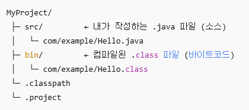
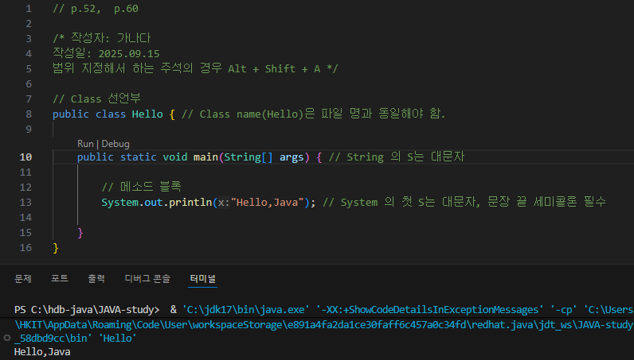
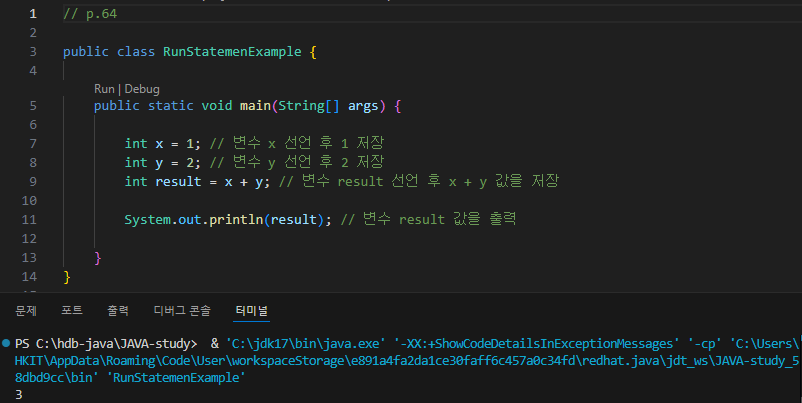

# 01. 자바 시작하기
## 01-1. 프로그래밍 언어와 자바 (p.38)

### 1. 소스 파일

1-1.  
**소스 파일**이란 프로그래밍 언어로, 컴퓨터가 바로 이해할 수 없는 언어이기 때문에 **컴파일**이라는 과정이 필요.

1-2.  
**JDK : 자바 개발 도구** (Java Development Kit)  
쉽게 설치 가능한 JDK에는 Open JDK와 Oracle JDK가 있다.

1-3.  
JDK를 실행 후 [사용자 계정 컨트롤]에서 디바이스 변경을 허용하면 C:\Program Files\Java 경로에 저장된다.

1-4.  
자바 컴파일러와 실행 명령어는 \bin 폴더에 있다.

### 2. bin 폴더

JDK 설치 폴더 안의 **bin 폴더**에는 개발할 때 필요한 **자바 컴파일러 파일**과 **실행 명령어 파일이 저장**되어 있다.  
이들은 bin 폴더 안에 있기 때문에 다른 폴더에서 실행할 수 없는데, **다른 폴더에서 실행하기 위해서는 환경변수 path에 bin 폴더를 등록**해야한다.

## 01-3. 자바 프로그램 개발 과정 (p.67 ~ 68)

### 1. 자바 프로그램 개발 과정

① 소스 파일 작성  
② javac 명령어로 컴파일  
③ 컴퓨터 언어로 변환이 완료되면 java 명령어로 실행  
④ 실행 결과를 확인

### 2. 자바 소스

2-1.  
자바 소스를 컴파일하면 확장명이 .class 라는 바이트 코드 파일이 생성된다.

2-2.  
main() 메소드는 클래스 블록 내부에 존재해야 실행 시 컴퓨터가 읽을 수 있다.

2-3.  
java 명령어로 실행하면 main() 메소드를 찾아 블록 내부를 실행한다. 그러므로 중괄호는 필수.

2-4.  
컴파일 후 실행하기 위해서는 반드시 문장 끝에 세미콜론(;)이 있어야 한다. 없으면 에러 뜸.

### 3. 주석

3-1.  
// 와 같은 라인의 내용은 주석 처리가 된다.

3-2.  
/* 부터 */ 까지의 내용은 몇 줄이 됐든 전부 주석 처리가 된다.

3-3.  
주석은 컴파일 과정에서 무시되고 실행문만 바이트 코드로 번역되므로, 주석을 많이 작성한다고 해서 바이트 코드 파일의 크기가 커지는 것이 아니다.

3-4.  
문자열 내부(" ")의 경우, 주석 기호는 주석문이 아니라 문자열 데이터로 인식하기 때문에 사용할 수 없다.

### 4. 이클립스의 자바 프로젝트

4-1.  
이클립스 환경에서의 기본 폴더 구조 :  
  
따라서 기본적으로 소스 파일과 바이트 코드 파일이 저장되는 폴더가 다르다.

4-2.  
위의 이미지를 참고해보면, 자바 소스 파일을 작성하는 폴더는 src 이다.

4-3.  
선언되는 클래스 이름은 반드시 소스 파일 이름과 동일해야 한다.

4-4.  
올바르게 작성된 소스 파일을 저장하면 자동으로 컴파일되고, 바이트 코드 파일이 생성된다.

### 5. 이클립스의 바이트 코드 실행법

① Package Explorer 뷰에서 소스파일 선택 후 툴 바에서 Run 아이콘 클릭 (또는 Ctrl + F11)

② Package Explorer 뷰에서 소스 파일 선택 후 우클릭 → Run As → Java Application

### 01-3. 예제 실습


* 기본 구조
* Hello, Java 출력

<br><br>


* 연산자 사용
* 3 출력

# 02. 변수와 타입

## 02-1. 변수 (p.79 ~ 80)

### 1. 변수

1-1.  
프로그래밍 언어마다 다르지만, 자바의 경우 **하나의 변수에 하나의 값을 저장**할 수 있다.

1-2.  
또한 자바의 경우 변수에 다양한 타입의 값을 저장할 수 없다. 정수 타입의 변수에는 정수값만 저장 가능하고, 실수 타입의 변수에는 실수값만 저장할 수 있다.

1-3.  
변수는 변수가 선언된 중괄호 안에서만 사용 가능하다.

1-4.  자바에서는 변수에 값이 지정되지 않으면 변수가 생성되지 않는다. 변수에 최초로 값이 저장될 때 변수가 생성되는데, 이를 **변수 초기화** 라고 한다. 그리고 이 때 사용된 값을 **초기값** 이라고 한다.

### 2.변수 이름

- 변수 이름으로 사용이 불가능한 경우:  
숫자나 특수문자로 시작하기(6hour/@speed), 자바 예약어 사용하기(class/int)

### 3. 컴파일 에러

- int sum;  
: 변수 이름(sum)이 선언되었고 세미콜론까지 붙어있으므로 정상 실행.

- int score1 = 0;  
: 변수 이름(score1)과 값(0)이 전부 지정되었고 세미콜론까지 붙어있으므로 정상 실행.

- int score2;  
: 변수 이름(score2)이 선언되었고 세미콜론까지 붙어있으므로 정상 실행.

- sum = score1 + score2;  
: 변수 선언을 하지 않았으므로 에러. (초기화가 안됨)

### 4. 변수 사용 범위

```
int v1 = 0;

if (true) {

    int v2 = 0;
    if (true) {

        int v3 = 0;

        v1 = 1;
        v2 = 1;
        v3 = 1;

    }

    v1 = v2 + v3;

}

System.out.println(v1);
```

컴파일 에러 위치: **v1 = v2 + v3;**  
→ 변수 v3가 변수가 선언된 블록을 벗어났기 때문.
