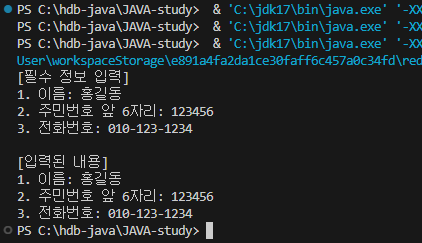

# 02. 변수와 타입

## 02-1. 변수 (p.79 ~ 80)

### 1. 변수

1-1.  
프로그래밍 언어마다 다르지만, 자바의 경우 **하나의 변수에 하나의 값을 저장**할 수 있다.

1-2.  
또한 자바의 경우 변수에 다양한 타입의 값을 저장할 수 없다. 정수 타입의 변수에는 정수값만 저장 가능하고, 실수 타입의 변수에는 실수값만 저장할 수 있다.

1-3.  
변수는 변수가 선언된 중괄호 안에서만 사용 가능하다.

1-4.  자바에서는 변수에 값이 지정되지 않으면 변수가 생성되지 않는다. 변수에 최초로 값이 저장될 때 변수가 생성되는데, 이를 **변수 초기화** 라고 한다. 그리고 이 때 사용된 값을 **초기값** 이라고 한다.

### 2.변수 이름

- 변수 이름으로 사용이 불가능한 경우:  
숫자나 특수문자로 시작하기(6hour/@speed), 자바 예약어 사용하기(class/int)

### 3. 컴파일 에러

- int sum;  
: 변수 이름(sum)이 선언되었고 세미콜론까지 붙어있으므로 정상 실행.

- int score1 = 0;  
: 변수 이름(score1)과 값(0)이 전부 지정되었고 세미콜론까지 붙어있으므로 정상 실행.

- int score2;  
: 변수 이름(score2)이 선언되었고 세미콜론까지 붙어있으므로 정상 실행.

- sum = score1 + score2;  
: 변수 선언을 하지 않았으므로 에러. (초기화가 안됨)

### 4. 변수 사용 범위

``` java
int v1 = 0;

if (true) {

    int v2 = 0;
    if (true) {

        int v3 = 0;

        v1 = 1;
        v2 = 1;
        v3 = 1;

    }

    v1 = v2 + v3;

}

System.out.println(v1);
```

컴파일 에러 위치: **v1 = v2 + v3;**  
→ 변수 v3은 if문 안에서 선언되었기 때문에 if문이 종료되는 시점에서 소멸되므로 컴파일러가 읽을 수 없음.

## 02-2. 기본 타입 (p.92 ~ 93)

### 1. 메모리 사용 크기별 자바의 기본 타입

- 정수 타입  
**byte**(1byte) / **short,char**(2byte) / **int**(4byte) / **long**(8byte)

- 실수 타입  
**float**(4byte) / **double**(8byte)

- 논리 타입  
**boolean**(8byte)

### 2. 변수에 값을 저장하는 코드

- byte var = 200;  
→ 200은 int로 해석되고, byte 타입의 범위는 -128 ~ 127 이므로 X

- char var = 'AB';  
→ 한 글자(하나의 UTF-16 코드 유닛)만 가능하므로 X

- char var = 65;  
→ 정수 리터럴 상수가 char 범위(0~65535) 내에 존재하므로 O

- long bar = 50000000000;  
→ 정수 리터럴 기본형은 int. 값이 int 범위를 넘어가므로 X

- float var = 3.14;  
→ 실수 리터럴 기본형은 double이고, f가 없으므로 X

- double var = 100.0;  
→ 기본 실수 리터럴이 double이므로 O

- String var = "나의 직업은 "개발자" 입니다."  
→ Escape 없이 큰따옴표 사용하면 문장이 닫혀버리므로 X

- boolean var = 0;  
→ 기본 실수 리터럴이 double이므로 O

- int v2 = 1e2;  
→ 1e2는 double 리터럴 이므로 X

- float = 1e2f;  
→ 변수 이름이 없으므로 X

### 3. 콘솔에 출력되는 내용
``` java
System.out.println("자바는");
System.out.println("\n재미있는 \"프로그래밍\" 언어\n");
System.out.println("입니다.");
```
``` java
자바는

재미있는 "프로그래밍" 언어

입니다.
```

### 4. 컴파일 에러 이유
``` java
double value = 2e350;
```
→ 2e350 = 2 × 10³⁵⁰, double 리터럴이 표현할 수 있는 한계 범위를 벗어나므로 에러.

### 5. 콘솔에 출력되는 내용
``` java
boolean stop = false;

if(stop) {

    System.out.println("멈춥니다.");

} else {

    System.out.println("출발합니다.");

}
```
→ 출발합니다.

## 02-3. 타입 변환 (p.107 ~ 110)

### 1. 자동 타입 변환
``` java
byte byteValue = 10;
char charValue = 'A';
```

- int intValue = byteValue;  
→ 10 출력, 에러 X

- int intValue = charValue;  
→ 65 출력, 에러 X

- short shortValue = charValue;  
→ short의 범위가 char보다 작으므로 컴파일 에러 발생

- double doubleValue = byteValue;  
→ 10 출력, 에러 X

### 2. 강제 타입 변환
``` java
int intValue = 10;
char charValue = 'A';
double doubleValue = 5.7;
String strValue = "A";
```

- double var = (double) intValue;  
→ 10 출력, 에러 X

- byte var = (byte) intValue;  
→ 10 출력, 에러 X

- int var = (int) doubleValue;  
→ 강제 형번환이므로 10 5.7 출력, 에러 X

- char var = (char) strValue;  
→ 문자열을 char 타입으로 강제 타입 변환 할 수 없으므로 컴파일 에러 발생

### 3. 연산식에서의 타입 변환
``` java
byte byteValue = 10;
float floatValue = 2.5F;
double doubleValue = 2.5;
```

- byte result = byteValue + byteValue;  
→ 연산은 기본적으로 int 타입이므로 컴파일 에러 발생

- int result = 5 + byteValue;  
→ int + int = int 이므로 15 출력, 에러 X

- float result = 5 + floatValue;  
→ int + float = float 이므로 7.5 출력, 에러 X

- double result = 5 + doubleValue;  
→ int + double = double 이므로 7.5 출력, 에러 X

### 4. 컴파일 에러 발생의 이유
``` java
short s1 = 1;
short s2 = 2;
int i1 = 3;
int i2 = 4;
short result = s1 + s2;
int result = i1 + i2;
```

→ short result = s1 + s2; 에서 컴파일 에러 발생. short + short 의 연산은 int로 승격됨.

### 5. 컴파일 에러 발생의 이유와 해결방안
``` java
char c1 = 'a';
char c2 = c1 + 1;

System.out.println(c2);
```

→ a의 유니코드는 97이므로 c1 + 1을 시도하면 char + int 이므로 int로 승격됨.  
따라서 char c2 = c1 + 1; 에서 컴파일 에러 발생.  
**int c2 = c1 + 1;** 혹은 **char c2 = (char)(c1 + 1);** 로 변경 필요

### 6. 타입 / 출력 결과 / 이유 작성하기
``` java
int x = 5;
int y = 2;
________ result = x / y;

System.out.println(result);
```

→ int / 출력 결과: 2 / 연산의 결과는 int 타입

### 7. 알맞은 코드 작성하기
``` java
int x = 5;
int y = 2;
____①____ result = __________②___________;

System.out.println(result);

// 출력 결과: 2.5
```

① double  
② (double) x / y

### 8. 알맞은 코드 작성하기
``` java
double var1 = 3.5;
double var2 = 2.7;
int result = _________________________;

System.out.println(result);

// 덧셈 연산 후 소수점 이하 자리 버리기
```

→ (int) (var1 + var2)  
var1 과 var2 를 괄호로 묶지 않을 경우 (int)var1 + (int)var2 로 적어줘야 함.

### 9. 알맞은 코드 작성하기
``` java
long var1 = 2L;
float var2 = 1.8f;
double var3 = 2.5;
String var4 = "3.9";
int result = _____________________________;

System.out.println(result);

// var1 ~ var4 덧셈 연산 후 int 타입 result 변수에 9 저장됨
```

→ (int)(var1 + var2 + var3 + Double.parseDouble(var4)) - 1

### 10. 출력 결과
``` java
String str1 = 2 + 3 + "";
String str2 = 2 + "" + 3;
String str3 = "" + 2 + 3;

System.out.println(str1);
System.out.println(str2);
System.out.println(str3);
```
▼
``` java
5
23
23
```

→ 문자열 나오기 전까진 int 타입, 문자열 나오는 순간 String 타입으로 바뀜.

### 11. 알맞은 코드 작성하기
``` java
byte value = _______①_______("10");
int value = _______②_______("1000");
float value = _______③_______("20.5");
double value = _______④_______("3.14159");
```
▼
``` java
① Byte.parseByte
② Integer.parseInt
③ Float.parseFloat
④ Double.parseDouble
```

## 02-4. 변수와 시스템 입출력 (p.120 ~ 121)

### 1. 알맞은 코드 작성하기
``` java
이름: 감자바
나이: 25
전화: 010-123-4567
```
``` java
String name = "감자바";
int age = 25;
String tel1 = "010", tel2 = "123", tel3 = "4567";

System.out.println(________________①________________);
System.out.print(________________②________________);
System.out.printf(________________③________________);
```
▼
``` java
① "이름: " + name
② "나이: " + age + "\n"
③ "전화: %1$s-%2$s-%3$s", tel1, tel2, tel3
```
- **println("내용") :** 괄호 안의 내용을 출력하고 행 바꾸기  
**print("내용") :** 괄호 안의 내용을 출력  
**printf("형식문자열", 값1, 값2, … ) :** 괄호 안의 첫 번째 문자열 형식대로 내용 출력

### 2. 알맞은 코드 작성하기
``` java
Scanner scanner = new scanner(System.in);

System.out.print("첫 번째 수: ");
String strNum1 = _____________①_____________;

System.out.print("두 번째 수: ");
String strNum2 = _____________②_____________;


int Num1 = _____________③_____________;
int Num2 = _____________④_____________;

int result = num1 + num2;
System.out.println("덧셈 결과: " + result);
```
▼
``` java
① scanner.nextLine();
② scanner.nextLine();
③ Integer.parseInt(strNum1);
④ Integer.parseInt(strNum2);
```
- scanner.nextLine(); → 키보드로 입력받음  
Integer.parseInt(변수); → 변수 값 int타입으로 강제 형변환

### 3. 코드 작성하기
``` java
[필수 정보 입력]
1. 이름: _______________ [enter]
2. 주민번호 앞 6자리: _______________ [enter]
3. 전화번호: _______________ [enter]

[입력된 내용]
1. 이름: 홍길동
2. 주민번호 앞 6자리: 123456
3. 전화번호: 010-123-1234
```
▼
``` java
import java.util.Scanner;

public class Exam020403 {

    public static void main(String[] args) throws Exception {

        Scanner scanner = new Scanner(System.in);

        System.out.println("[필수 정보 입력]");

        System.out.print("1. 이름: ");
        String name = scanner.nextLine();

        System.out.print("2. 주민번호 앞 6자리: ");
        String rrn = scanner.nextLine();

        System.out.print("3. 전화번호: ");
        String tel = scanner.nextLine();

        System.out.println();
        
        System.out.println("[입력된 내용]");

        System.out.println("1. 이름: " + name);
        System.out.println("2. 주민번호 앞 6자리: " + rrn);
        System.out.println("3. 전화번호: " + tel);

    }

}
```
결과 ▼
