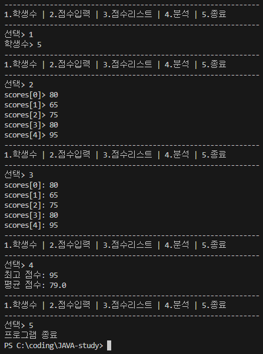

# 05. 참조 타입

## 05-1. 참조 타입과 참조 변수 (p.197 ~ 198)

### 1. 참조 타입

1-1.  
참조 타입에는 기본 타입을 제외한 배열, 열거, 클래스, 인터페이스가 있다.

1-2.  
참조 변수의 메모리 생성 위치는 스택이다.

1-3.  
참조 타입에서 ==, != 연산자는 값이 아닌 객체 번지를 비교한다.

1-4.  
참조 변수는 null값도 초기값으로 사용할 수 있기 때문에 null로 초기화된 참조 변수는 스택 영역에 생성된다.

### 2. 자바에서 메모리 사용

2-1.  
로컬 변수는 메서드가 호출될 때 만들어지는 스택 프레임에 저장되고, 블록/메서드가 끝나면 스코프를 벗어나면서 사라진다. 이 때, 로컬 변수에 담긴 참조만 스택에 있고, 그 참조가 가리키는 객체 자체는 힙에 있음.

2-2.  
상수, 메소드 코드, 생성자 코드는 메소드 영역에 생성된다.

2-3.  
의미 없는 객체는 JVM이 이것을 쓰레기로 취급하고 Garbage Collector를 실행시켜 자동으로 제거한다.

2-4.  
배열 및 객체는 힙 영역에 생성된다.

### 3. String 타입

3-1.  
String은 클래스이므로 참조 타입이다.

3-2.  
String의 문자열 비교는 ==가 아니라 equals()을 사용해야 한다.  
==는 객체(참조) 동일성 비교, equals()는 내용 비교.

3-3.  
동일한 문자열 리터럴을 저장하는 변수는 동일한 String 객체를 참조한다.

3-4.  
new String("문자열")은 무조건 새로운 String 객체를 생성한다.

### 4. 참조 변수

4-1.  
참조 변수에 저장되는 것은 객체의 번지가 아니라 객체를 가리키는 번지 값이다.

4-2.  
참조 변수에 null을 저장해서 변수를 초기화시킬 수 있다.

4-3.  
참조 변수에 null이 저장된 상태에서는 객체를 사용할 수 없다.

4-4.  
NullPointerException은 초기화되지 않은 참조 변수에서 발생하는 것이 아니라, 초기화는 되었지만 값이 null인 데이터나 메소드를 사용하는 코드를 실행하면 발생한다.

### 5. 실행 결과

```java
int var1 = 10;
int var2 = 10;
String var3 = "AB";
String var4 = "AB";
String var5 = new String("AB");
```

▼

```java
① var1 == var2 // true
② var1 != var2 // false
③ var3 == var4 // true
④ var3 != var5 // true (다른 객체)
⑤ var4.equals(var5) // true (equals는 객체와는 상관없이 내부 문자열 비교)
```

## 05-2. 배열 (p.222 ~ 224)

### 1. 배열을 생성하는 방법

1-1.  
int[] array = {1, 2, 3};

1-2.  
int[] array;  
array = {1, 2, 3};  
→ 값의 목록으로 배열 객체를 생성할 때, 배열 변수를 이미 선언한 후에 다른 실행문에서 중괄호를 사용한 배열 생성이 허용되지 않는다는 점을 주의해야 한다. 배열 목록이 나중에 결정될 경우라면 new 연산자 사용하기.

1-3.  
int[] array = new int[3];

1-4.  
int[][] array = new int[3][2];

### 2. 배열의 기본 초기값

2-1.  
정수 타입 배열 항목의 기본 초기값은 0이다.

2-2.  
실수 타입 배열 항목의 기본 초기값은 0.0F(float타입) 또는 0.0(double타입)이다.

2-3.  
boolean 타입 배열 항목의 기본 초기값은 false 이다.

2-4.  
참조 타입 배열 항목의 기본 초기값은 객체를 아직 넣지 않았으므로 null 이다.

### 3. 배열의 길이

```java
int[][] array = {

    {95, 86}, // 0
    {83, 92, 96}, // 1
    {78, 83, 93, 87, 88} // 2

};

// array.length의 값과 array[2].length의 값
```

▼

```java
array.length : 3 // 행의 개수
array[2].length : 5 // {78, 83, 93, 87, 88}
```

### 4. 알맞은 코드 작성하기 (java - Exam040502.java)

```java
public class Exam040502 {

    public static void main(String[] args) {

        int max = 0;
        int[] array = {1, 5, 3, 8, 2};

        // for문을 사용하여 최대값 구하는 코드 작성하기

        System.out.println("max : " + max);

    }

}
```

▼

```java
for (int i = 1; i < array.length; i++) {

    if (array[i] > max) { // max 값보다 큰 경우 내부 코드 실행

        max = array[i]; // max 값에 array[i] 값 넣음, 큰 수가 올 때마다 갱신

    }

}

// max(최대값) : 8
```

### 5. 알맞은 코드 작성하기 (java - Exam050502.java)

```java
public class Exam050502 {

	public static void main(String[] args) {

		int[][] array = {
            { 95, 86 },
            { 83, 92, 96 },
            { 78, 83, 93, 87, 88 }
        };

		int sum = 0;
		double avg = 0.0;

        // for문을 사용하여 주어진 배열의 전체 항목의 합과 평균값 구하는 코드 작성하기

		System.out.println("sum: " + sum);
		System.out.println("avg: " + avg);

	}

}
```

▼

```java
int count = 0; // 전체 개수를 직접 세지 않고 자동으로 세어주는 변수

for (int i = 0; i < array.length; i++) {

	for (int j = 0; j < array[i].length; j++) {

		sum += array[i][j];
		count++; // +1

	}

	avg = (double) sum / count; // count = 10

}

// sum(합계) : 881, avg(평균) : 88.1
```

### 6. 알맞은 코드 작성하기 (java - Exam060502.java)

```java
import java.util.Scanner;

public class Exam060502 {
    public static void main(String[] args) {

        boolean run = true;
        int studentNum = 0;
        int[] scores = null;
        Scanner scanner = new Scanner(System.in);

        while (run) {

            System.out.println("--------------------------------------------------------------");
            System.out.println("1.학생수 | 2.점수입력 | 3.점수리스트 | 4.분석 | 5.종료");
            System.out.println("--------------------------------------------------------------");
            System.out.print("선택> ");

            int selectNo = Integer.parseInt(scanner.nextLine());

            if (selectNo == 1) {

                // 키보드로부터 각 학생들의 점수를 입력받아서, 최고 점수 및 평균 점수를 구하는 프로그램의 코드 작성하기 1번

            } else if (selectNo == 2) {

                // 코드 작성하기 2번

            } else if (selectNo == 3) {

                // 코드 작성하기 3번

            } else if (selectNo == 4) {

                // 코드 작성하기 4번

            } else if (selectNo == 5) {

                run = false;

            }
        }

        System.out.println("프로그램 종료");

    }
}
```

▼

```java
// 코드 1번
// 학생 수 입력 받아서 저장하는 코드

System.out.print("학생수> ");

studentNum = Integer.parseInt(scanner.nextLine()); // 입력 받음
scores = new int[studentNum]; // null 상태인 studentNum 에 저장

```

```java
// 코드 2번
// 학생 수만큼 점수 입력 받아서 저장하는 코드

for (int i = 0; i < scores.length; i++) { // scores.length = 학생수

    System.out.print("scores[" + i + "]> ");
    scores[i] = Integer.parseInt(scanner.nextLine()); // 점수 입력 받음

}
```

```java
// 코드 3번
// 2번에서 입력한 점수를 출력하는 코드

for (int i = 0; i < scores.length; i++) { // scores.length = 학생수

    System.out.println("scores[" + i + "]: " + scores[i]); // 점수 출력

}
```

```java
// 코드 4번
// 받은 점수들을 연산하여 최고점수와 평균점수 출력하는 코드

int max = 0; // 초기화
int sum = 0;
double avg = 0;

for (int i = 0; i < scores.length; i++) { // scores.length = 학생수

    max = (max < scores[i]) ? scores[i] : max; // 최고 점수 가려냄
    sum += scores[i]; // 총합 (평균 낼 때 필요)

}

avg = (double) sum / studentNum; // 평균

System.out.println("최고 점수: " + max);
System.out.println("평균 점수: " + avg);
```

### +) 6번 문제 출력 결과



## 5-3. 열거 타입 (p.232)

### 1. 열거 타입

1-1.  
열거 타입(enum)은 한정된 값을 가지는 타입이므로 미리 정의한 상수 집합만 가질 수 있다.

1-2.  
열거 타입 변수에는 열거 타입에 정의된 상수를 대입할 수 있다.

1-3.  
자바의 열거 타입(enum)은 참조 타입이라서 null을 대입할 수 있다.

1-4.  
열거 상수는 관례적으로 대문자로 작성한다. 여러 단어로 구성된 경우 SNAKE_CASE 방식을 사용한다.

### 2. 열거 타입 선언하기

```java
LoginResult result = LoginResult.FAIL_PASSWORD; // 열거 타입 변수 선언

if(result == LoginResult.SUCCESS) { // 첫 번째
    …
} else if(result == LoginResult.FAIL_ID) { // 두 번째
    …
} else if(result == LoginResult.FAIL_PASSWORD) { // 세 번째
    …
}
```

▼

```java
// 열거 타입 선언

public enum LoginResult {
    SUCCESS, // 첫 번째
    FAIL_ID, // 두 번째
    FAIL_PASSWORD // 세 번째
}
```
