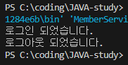
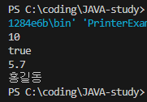
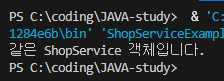

# 06. 클래스

## 06-1. 객체 지향 프로그래밍 (p.244 ~ 245)

### 1. 객체와 클래스

1-1.  
클래스는 객체를 생성하기 위한 설계도와 같은 것이다.

1-2.  
new 연산자로 클래스의 생성자를 호출함으로써 객체가 생성된다.

1-3.  
하나의 클래스에 new 연산자를 사용한 만큼 객체를 메모리에 여러개 생성할 수 있다.

1-4.  
객체는 클래스의 인스턴스이다.

### 2. 필드, 생성자, 메소드

2-1.  
메소드는 객체의 동작(실행코드 보유)에 해당하는 중괄호{} 블록을 말한다. 중괄호 블록은 이름을 가지고 있는데, 이것이 메소드 이름이다.

2-2.  
필드는 객체의 고유 데이터, 부품 객체, 상태 정보를 저장하는 곳이다.

2-3.  
생성자는 new 연산자로 호출되는 특별한 중괄호{} 블록이다. 객체 생성 시 초기화를 담당한다.

### 3. 빈 칸 채우기

```java
public class Member {

    String name; // 1. 필드. 데이터 저장 담당

    Member(String name) { … } // 2. 생성자. 데이터 초기화 담당

    void setName(String name) { … } // 3. 메소드. 동작 실행 담당

}
```

## 06-2. 필드 (p.252 ~ 253)

### 1. 필드

1-1.  
클래스 필드는 인스턴스 변수이기 때문에, 메소드 안에서 this.필드명 또는 그냥 필드명으로 접근(사용)할 수 있다.

1-2.  
필드는 클래스 블록 어디서든 선언할 수 있다.(생성자, 메소드 내부 제외)

1-3.  
필드는 접근 제어자가 Public인 경우 객체 외부에서 접근할 수 있다.

1-4.  
필드는 초기값을 주지 않더라도 기본값으로 자동 초기화된다.

### 2. 클래스 선언

| 데이터 이름 | 필드 이름 | 타입   |
| ----------- | --------- | ------ |
| 이름        | name      | 문자열 |
| 아이디      | id        | 문자열 |
| 패스워드    | password  | 문자열 |
| 나이        | age       | 정수   |

▼

```java
public class Member {

    // 필드
    String name; // 이름 문자열
    String id; // 아이디 문자열
    String password; // 패스워드 문자열
    int age; // 나이 정수

}
```

### 3. 알맞은 코드 작성하기

```java
public class MemberExample {

    public static void main(String[] args) {

        Member member = _____________①______________;
        __________②__________ = "최하얀"; // name 필드값 변경
        __________③__________ = 23; // age 필드값 변경

    }

}

// Member 클래스의 필드를 MemberExample 클래스의 main() 메소드에서 사용하기 위한 코드 작성하기
```

▼

```java
① new Member(); // 객체 생성 new 연산자 사용
② member.name = "최하얀";
③ member.age = 23;
```

## 6-3. 생성자 (p.266 ~ 268)

### 1. 생성자

1-1.  
객체를 생성하려면 생성자 호출이 반드시 필요하다.

1-2.  
생성자는 다른 생성자를 호출하기 위해 this()를 사용할 수 있다.

1-3.  
생성자가 선언되지 않으면 컴파일러가 기본 생성자를 추가한다.

1-4.  
매개 변수의 수, 타입, 순서가 다른 생성자를 여러 개 선언할 수 있다. - 생성자 오버로딩(Overloading) 개념

### 2. 클래스 작성하기

```java
Member user1 = new Member("홍길동", "hong");

// Member객체 생성, name필드와 id필드 외부에서 받은 값으로 초기화할 수 있게 Member 클래스 코드 작성
```

▼

```java
public class Member {

    // 필드
    String name; // 이름 문자열
    String id; // 아이디 문자열
    String password; // 패스워드 문자열
    int age; // 나이 정수

    Member(String name, String id) {

        this.name = name;
        this.id = id;

    }

}
```

### 3. 중복 코드 제거하기

```java
public class Board {

	String title;
	String content;
	String writer;
	String date;
	int hitcount;

	Board(String title, String content) {

		// this()로 묶어서 또다른 생성자 호출로 변경
        this(title, content, "로그인한 회원아이디", "현재 컴퓨터 날짜", 0);

        // 기존 코드
        /* this.title = title;
        this.content = content;
        this.writer = "로그인한 회원아이디";
        this.date = "현재 컴퓨터 날짜";
        this.hitcount = 0; */

	}

	Board(String title, String content, String writer) {

		this(title, content, writer, "현재 컴퓨터 날짜", 0);

        /* this.title = title;
        this.content = content;
        this.writer = writer;
        this.date = "현재 컴퓨터 날짜";
        this.hitcount = 0; */

	}

	Board(String title, String content, String writer, String date) {

		this(title, content, writer, date, 0);

        /* this.title = title;
        this.content = content;
        this.writer = writer;
        this.date = date;
        this.hitcount = 0; */

	}

	Board(String title, String content, String writer, String date, int hitcount) {

		this.title = title;
		this.content = content;
		this.writer = writer;
		this.date = date;
		this.hitcount = hitcount;

	}

}
```

### 4. Board 객체 생성하는 네 가지 방법 (ChatGPT - 06-03-04.md)

```java
① Board board1 = new _____________________________;
② Board board2 = new _____________________________;
③ Board board3 = new _____________________________;
④ Board board4 = new _____________________________;
```

▼

```java
① Board board1 = new Board("title", "content");
② Board board2 = new Board("title", "content", "writer");
③ Board board3 = new Board("title", "content", "writer", "date");
④ Board board4 = new Board("title", "content", "writer", "date", 0);
```

## 6-4. 메소드

### 1. 메소드

```
① 리턴값이 없는 메소드는 리턴 타입을 ( void ) 로 해야 한다.
② 리턴 타입이 있는 메소드는 리턴 값을 지정하기 위해 반드시 ( return )문이 있어야 한다.
③ 매개값의 개수를 모를 경우 ( … ) 를 이용해서 매개 변수를 선언할 수 있다.
④ 같은 이름의 메소드를 여러 개 선언하는 것을 메소드 ( 오버로딩 ) 이라고 한다.
```

### 2. 메소드 오버로딩

2-1.  
동일한 이름의 메소드를 여러 개 선언하는 것을 말한다.

2-2.  
오버로딩은 "매개변수 시그니처(타입, 개수, 순서)"가 달라야 하며, 리턴 타입은 오버로딩 조건이 아님.

2-3.  
매개 변수의 타입, 개수, 순서를 다르게 선언해야 한다.

2-4.  
매개값의 타입 및 개수에 따라 호출될 메소드가 선택된다.

### 3. 알맞은 코드 작성하기

```
MemberService 클래스

- `login()` 메소드
  - 매개값: id(String), password(String)
  - 리턴값: boolean
  - id가 `"hong"`, password가 `"12345"`이면 `true` 리턴, 아니면 `false` 리턴

- `logout()` 메소드
  - 매개값: id(String)
  - 리턴값: void
  - `"로그아웃 되었습니다."` 출력
```

▼

```java
public class MemberService {

    /**
     * 로그인 기능 메소드
     * @param id        사용자 아이디
     * @param password  사용자 비밀번호
     * @return          로그인 성공(true) / 실패(false)
     */

    boolean login(String id, String password) {

        // id가 "hong"이고 password가 "12345"일 경우 로그인 성공
        if (id.equals("hong") && password.equals("12345")) {

            return true;

        }

        return false;

    }

    /**
     * 로그아웃 기능 메소드
     * @param id   사용자 아이디 (여기서는 사용하지 않지만, 매개변수 형식으로 포함됨)
     */

    void logout(String id) {

        System.out.println("로그아웃 되었습니다.");

    }

}
```

```java
public class MemberServiceExample {

    public static void main(String[] args) {

        MemberService memberService = new MemberService();

        // 로그인 시도
        boolean result = memberService.login("hong", "12345");

        if (result) {

            System.out.println("로그인 되었습니다.");
            memberService.logout("hong"); // 로그아웃 처리

        } else {

            System.out.println("아이디 또는 비밀번호가 올바르지 않습니다.");

        }
    }
}
```

### +) 3번 문제 출력 결과



<br>

### 4. 메소드 선언 코드 작성하기

```
PrinterExample 클래스에서 Printer 객체를 생성하고 다음의 출력 결과가 나오도록
Printer 클래스의 메소드 작성하기

- 출력 메소드: `println(int)`, `println(boolean)`, `println(double)`, `println(String)`
```

▼

```java
public class Printer {

    /**
     * 정수(int) 값을 출력하는 메소드
     * @param value 출력할 정수 값
     */

    static void println(int value) {

        System.out.println(value);

    }

    /**
     * 논리(boolean) 값을 출력하는 메소드
     * @param value 출력할 true/false 값
     */

    void println(boolean value) {

        System.out.println(value);

    }

    /**
     * 실수(double) 값을 출력하는 메소드
     * @param value 출력할 실수 값
     */

    void println(double value) {

        System.out.println(value);

    }

     /**
     * 문자열(String) 값을 출력하는 메소드
     * @param value 출력할 문자열
     */

    void println(String value) {

        System.out.println(value);

    }
}
```

```java
public class PrinterExample {

    public static void main(String[] args) {

        Printer printer = new Printer();

        // 다양한 타입 출력
        printer.println(10);          // int
        printer.println(true);        // boolean
        printer.println(5.7);         // double
        printer.println("홍길동");     // String

    }

}
```

### +) 4번 문제 출력 결과



<br>

## 6-5. 인스턴스 멤버와 정적 멤버

### 1. 인스턴스 멤버와 정적 멤버

1-1.  
정적 멤버는 static으로 선언된 필드와 메소드를 말한다.

1-2.  
인스턴스 필드는 객체마다 개별적으로 존재하고, 생성자가 호출될 때 필드 초기화를 해줄 수 있다.

```java
// 예제

class Person {
    String name;
    int age;
    Person(String n, int a) {   // 생성자에서 인스턴스 필드 초기화 가능
        name = n;
        age = a;
    }
}

```

1-3.  
정적 필드와 메소드는 객체 생성 없이 클래스를 통해 접근할 수 있다.

1-4.  
인스턴스 필드와 메소드는 객체를 생성하고 사용해야 한다.

### 2. final 필드와 상수(static final)

2-1.  
final 필드와 상수는 초기값이 저장되면 값을 변경할 수 없다.

2-2.  
final 필드는 생성자에서 초기화할 수 있으며 객체마다 다른 값 할당 가능하다.  
하지만 상수(static final)는 선언 시점에 반드시 초기값을 줘야 하고, 생성자에서 초기화할 수 없음.

2-3.  
상수의 이름은 대문자로 작성하는 것이 관례이다.

2-4.  
상수는 객체 생성 없이 클래스를 통해 사용할 수 있다.

<br>

**+)final 필드와 static final 상수 비교표**

| 구분                | final 필드 (인스턴스 상수)   | static final 상수 (클래스 상수)       |
| ------------------- | ---------------------------- | ------------------------------------- |
| 소속                | 객체(인스턴스)               | 클래스(공용)                          |
| 초기화 시점         | 선언 시 또는 생성자에서 가능 | 반드시 선언 시점에서 초기화 필요      |
| 값 변경 여부        | 한 번 초기화 후 변경 불가    | 한 번 초기화 후 변경 불가             |
| 객체 생성 필요 여부 | 객체 생성 후 사용 가능       | 객체 생성 없이 `클래스명.상수`로 사용 |
| 예시                | `final int age;`             | `static final double PI = 3.14159;`   |

<br>

### 3. 코드 작성하기

```java
ShopService 객체를 싱글톤으로 만들기
ShopServiceExample 클래스에서 ShopService의 getInstance() 메소드로 싱글톤을 얻을 수 있도록 ShopService 클래스 작성하기
```

▼

```java
public class ShopService {

    // 1. 클래스 내부에 자기 자신의 객체를 정적 필드로 생성
    private static ShopService singleton = new ShopService();

    // 2. 생성자를 private으로 막아서 외부에서 new로 객체 생성 불가
    private ShopService() {}

    // 3. 외부에서 호출할 수 있는 정적 메소드 제공 (싱글톤 반환)
    public static ShopService getInstance() {

        return singleton;

    }

}
```

```java
public class ShopServiceExample {

    public static void main(String[] args) {

        ShopService obj1 = ShopService.getInstance();
        ShopService obj2 = ShopService.getInstance();

        if (obj1 == obj2) {

            System.out.println("같은 ShopService 객체입니다.");

        } else {

            System.out.println("다른 ShopService 객체입니다.");

        }
    }
}
```

### +) 3번 문제 출력 결과



<br>

## 6-6. 패키지와 접근 제한자

### 1. 접근 제한

1-1.  
접근 제한자는 클래스, 필드, 생성자, 메소드의 사용을 제한한다.  
접근 제한자는 클래스 멤버(필드, 생성자, 메소드)뿐만 아니라 클래스 자체에도 적용된다.

1-2.  
public 접근 제한은 아무런 제한 없이 해당 요소를 사용할 수 있게 한다.  
같은 패키지, 다른 패키지 상관없이 어디서든 접근 가능.

1-3.  
default 접근 제한은 같은 패키지 내부 에서만 접근 가능하다.  
해당 클래스 내부에서만 사용을 허가하는 것은 private

1-4.  
1-3의 내용에서 미루어보아 외부에서 접근하지 못하도록 하려면 private 접근 제한을 해야 한다.
